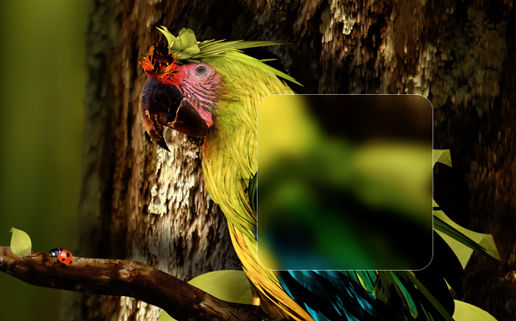

Übersicht | Blur Widget
=================
:closed_book: [Übersicht Homepage](http://tracesof.net/uebersicht/)
&nbsp;&nbsp;&nbsp;:pushpin: [Übersicht Widgets](http://tracesof.net/uebersicht-widgets/)
&nbsp;&nbsp;&nbsp;:page_facing_up: [Widgets GitHub Repo](https://github.com/felixhageloh/uebersicht-widgets)

Create background blurred zones with Übersicht on Mac OS X



# Default Filters Values
```
filters =
    blur: 10
    brightness: 110
    saturate: 105
    contrast: 105
```

# Definition of each blurred bloc

- **left**, **top**, **width** and **height** are required (in pixels). 
- Optionnaly you can set additionals styles and image blur, brightness, saturate or contrast.

You can set to **"auto"** **left** or **width** and **top** or **height**

**Exemples:**

* left: "auto" and width: 200 (200 pixels width bloc positioned on the right
* left: 200 and width: "auto" (A bloc starting at 200px from the left to the end of the screen)
* top: "auto" and height: 300 (300 pixels height bloc positioned on bottom)

```
blocs = [
    {
        "left": 330
        "top": 98
        "width": 780
        "height": 44
        "style": {"border-radius":5, "border": "solid 1px rgba(255,255,255,0.1)"}
    }
    {
        "left": 0
        "top": "auto"
        "width": "auto"
        "height": 190
        "blur": 8
        "style": {"border-top": "solid 1px rgba(255,255,255,0.1)"}
    }
]
```

